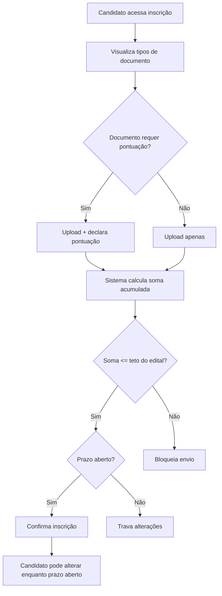
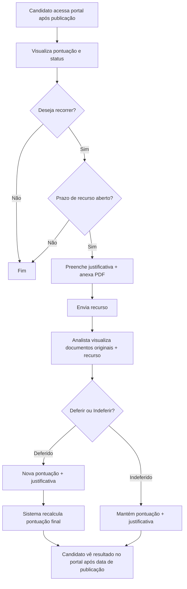

# Análise de Requisitos — Análise Documental
**Data:** 22/09/2026

**Analista:** Requirements Copilot (baseado no framework de Ahirton Lopes)

**Input:** `questionamentos_analise-documental_solicitante_1__1_.md`

---

## 1. MAPA DE DOMÍNIOS

| Domínio | Descrição | Confiança |
|---------|-----------|-----------|
| Gestão de Processos Seletivos Acadêmicos | Sistema de ingresso para cursos de qualificação, especialização e mestrado com etapa classificatória por análise documental | Alta |
| Gestão de Documentos e Pontuação | Upload, validação e pontuação de documentos comprobatórios pelos candidatos e analistas | Alta |
| Gestão de Calendários de Etapas | Controle de prazos e datas para análise, entrevista, nivelamento e recurso | Alta |
| Portal do Candidato | Visualização de status, pontuação e interposição de recurso pelo candidato | Alta |
| Gestão de Perfis e Permissões | Criação e atribuição do novo perfil "Analista de Documento" | Média |

---

## 2. MAPA DE STAKEHOLDERS

| Stakeholder | Tipo | Requisitos que defende | Conflitos |
|-------------|------|------------------------|-----------|
| [SETOR SOLICITANTE] (setor solicitante) | Negócio | Cadastro de edital com critério "Análise Documental", calendários, publicação de listas no site institucional | Nenhum identificado |
| Candidato | Usuário final | Enviar documentos com pontuação declarada, acompanhar resultado pelo portal, interpor recurso | Nenhum identificado |
| Analista de Documento (Coordenador de Curso) | Usuário final | Analisar documentos, atribuir pontuação com justificativa, julgar recursos, desclassificar candidatos | Nenhum identificado |
| Administrador do Sistema | Técnico | Cadastrar perfis, tipos de documento, parâmetros globais de pontuação | Pendente: quem cadastra o perfil Analista? [VALIDAR COM EQUIPE] |
| [GESTÃO LOCAL] | Negócio/Técnico | Atribuir analistas às ofertas do [UNIDADE]? [VALIDAR COM EQUIPE] | Pendente de decisão (pergunta 5 do documento) |

---

## 3. ESTRUTURA DE ÉPICOS

| Épico | Descrição | Complexidade | Justificativa | Domínio |
|-------|-----------|--------------|---------------|---------|
| **E1 — Configuração de Edital com Análise Documental** | Permitir cadastrar editais com critério "Análise Documental", pesos de entrevista, pontuação máxima e checkboxes de etapas | M | Envolve extensão de modelo de dados existente (edital) + UI condicional, mas reaproveita estrutura já existente | Gestão de Processos Seletivos |
| **E2 — Gestão de Calendários de Etapas** | CRUD de calendários por edital ou por curso/oferta, com vinculação a etapas do processo seletivo | M | Novo CRUD com dois modos de escopo (edital vs. curso), reutilizável em múltiplas etapas | Gestão de Calendários |
| **E3 — Inscrição com Pontuação Declarada** | Candidato envia documentos com pontuação, sistema valida tetos e bloqueia excesso | G | Envolve upload de arquivos, validação de regras de negócio complexas (tetos por tipo e por edital), cálculo em tempo real | Gestão de Documentos |
| **E4 — Análise e Classificação Documental** | Analista pontua documentos, calcula pontuação final com pesos, desclassifica, corrige pontuação manualmente | GG | Tela complexa com visualizador de PDF, cálculo ponderado, lista editável com auditoria, múltiplos fluxos condicionais (com/sem entrevista) | Gestão de Processos Seletivos |
| **E5 — Recurso da Análise Documental** | Candidato interpõe recurso via portal, analista julga com nova pontuação | M | Fluxo bidirecional portal↔analista, recálculo de pontuação, respeito a datas de publicação | Portal do Candidato |
| **E6 — Perfil Analista de Documento** | Novo perfil com permissões restritas a cursos/ofertas vinculados | P | Extensão do modelo de permissões existente, escopo bem delimitado | Gestão de Perfis |

---

## 4. USER STORIES

### US-01 — Cadastrar critério "Análise Documental" no edital

**Card:** Como profissional da [SETOR SOLICITANTE], quero selecionar "Análise Documental" como critério de seleção no cadastro do edital, para que o sistema habilite o fluxo de análise documental para aquele processo seletivo.

**INVEST:**
- Independent: PASS — não depende de outras histórias para ser desenvolvida
- Negotiable: PASS — escopo claro e negociável
- Valuable: PASS — habilita o fluxo principal
- Estimable: PASS — extensão de combobox existente
- Small: PASS — cabe em um sprint
- Testable: PASS — QA pode verificar seleção e persistência

**Gherkin:**

Cenário: Selecionar Análise Documental como critério
  Dado que estou no cadastro de um novo edital
  Quando seleciono "Análise Documental" no campo critério de seleção
  Então o sistema salva o critério como "Análise Documental"
  E o campo "Pontuação máxima total" torna-se obrigatório

Cenário: Editar edital existente com critério já definido
  Dado que o edital 01/2026 já possui critério "Importação da classificação"
  Quando tento alterar para "Análise Documental"
  Então o sistema exibe alerta informando que os dados de classificação importada serão desconsiderados
  E ao confirmar, o critério é alterado

**Dependências:** Nenhuma
**Notas técnicas:** O critério "Importação da classificação" deve permanecer disponível. Os dois são mutuamente exclusivos por edital.

---

### US-02 — Configurar pesos de entrevista no edital

**Card:** Como profissional da [SETOR SOLICITANTE], quero definir os pesos de análise documental e entrevista (em percentuais) ao cadastrar um edital com entrevista, para que o sistema calcule automaticamente a pontuação final ponderada.

**INVEST:**
- Independent: PASS
- Negotiable: PASS
- Valuable: PASS — automatiza cálculo manual propenso a erros
- Estimable: PASS
- Small: PASS
- Testable: PASS

**Gherkin:**

Cenário: Configurar pesos quando edital terá entrevista
  Dado que marquei "Terá entrevista?" no cadastro do edital
  Quando informo peso 60% para análise documental e 40% para entrevista
  Então o sistema valida que a soma é 100%
  E salva os pesos vinculados ao edital

Cenário: Pesos não somam 100%
  Dado que estou configurando os pesos de um edital com entrevista
  Quando informo 50% para análise documental e 40% para entrevista
  Então o sistema exibe mensagem de erro "A soma dos pesos deve ser 100%"
  E não permite salvar

**Dependências:** US-01
**Notas técnicas:** Pesos armazenados como inteiros (percentuais). Validação de soma = 100% obrigatória.

---

### US-03 — Cadastrar calendário de etapa por edital

**Card:** Como profissional da [SETOR SOLICITANTE], quero cadastrar um calendário de etapa com escopo "por edital", para que todas as ofertas do edital compartilhem as mesmas datas de início, fim e publicação.

**INVEST:**
- Independent: PASS
- Negotiable: PASS
- Valuable: PASS — centraliza datas para editais homogêneos
- Estimable: PASS
- Small: PASS
- Testable: PASS

**Gherkin:**

Cenário: Cadastrar calendário por edital
  Dado que estou no cadastro de calendário de etapa
  Quando seleciono tipo "Análise Documental", escopo "Por edital", edital "01/2026"
  E informo início 01/08/2026, fim 30/08/2026, publicação 05/09/2026
  Então o sistema salva o calendário vinculado ao edital
  E o calendário fica disponível para vinculação no cadastro do edital

Cenário: Data de publicação anterior à data de fim
  Dado que estou cadastrando um calendário
  Quando informo data de fim 30/08/2026 e data de publicação 25/08/2026
  Então o sistema exibe erro "A data de publicação deve ser posterior à data de fim"
  E não permite salvar

**Dependências:** Nenhuma
**Notas técnicas:** Calendário reutilizável em vários editais. Tipos de etapa: Análise Documental, Entrevista, Nivelamento, Recurso.

---

### US-04 — Cadastrar calendário de etapa por curso/oferta

**Card:** Como profissional da [SETOR SOLICITANTE], quero cadastrar calendários de etapa com escopo "por curso/oferta", para que cada oferta de um edital possa ter datas distintas de análise, entrevista e recurso.

**INVEST:**
- Independent: PASS
- Negotiable: PASS
- Valuable: PASS — atende realidade de editais com cursos em campi diferentes
- Estimable: PASS
- Small: PASS
- Testable: PASS

**Gherkin:**

Cenário: Cadastrar calendário por oferta
  Dado que estou no cadastro de calendário de etapa
  Quando seleciono escopo "Por curso/oferta" e oferta "[CURSO EXEMPLO] - [CIDADE A]"
  E informo datas de início, fim e publicação
  Então o sistema salva o calendário vinculado à oferta específica

Cenário: Edital com 3 cursos tem 3 calendários distintos
  Dado um edital com ofertas em [CIDADE A], [CIDADE B] e [CIDADE C]
  Quando cadastro 3 calendários "por curso" para a etapa Análise Documental
  Então cada oferta possui seu próprio calendário com datas independentes

**Dependências:** Nenhuma
**Notas técnicas:** Mesma estrutura de dados da US-03, com vínculo a oferta ao invés de edital.

---

### US-05 — Configurar tipo de documento com pontuação

**Card:** Como administrador do sistema, quero marcar um tipo de documento com "Requer pontuação?" e definir teto de pontos, para que apenas documentos pontuáveis exibam campo de pontuação no formulário de inscrição.

**INVEST:**
- Independent: PASS
- Negotiable: PASS
- Valuable: PASS — diferencia documentos comprobatórios de documentos obrigatórios sem pontuação
- Estimable: PASS
- Small: PASS
- Testable: PASS

**Gherkin:**

Cenário: Ativar pontuação em tipo de documento
  Dado que estou no cadastro de Tipos de Documento
  Quando marco "Requer pontuação?" e defino teto de 30 pontos para "Artigo em periódico"
  Então o sistema salva a configuração
  E o teto fica disponível para sobrescrita por tipo de documento

Cenário: Tipo de documento sem pontuação
  Dado que "RG" não está marcado com "Requer pontuação?"
  Quando o candidato visualiza o formulário de inscrição
  Então o documento "RG" aparece sem campo de pontuação

**Dependências:** Nenhuma
**Notas técnicas:** Teto global definido em parâmetros do sistema; teto por tipo de documento sobrescreve o global.

---

### US-06 — Candidato declara pontuação ao enviar documentos

**Card:** Como candidato, quero declarar uma pontuação para cada documento pontuável que envio na inscrição, para que o sistema calcule a soma acumulada e valide contra o teto do edital.

**INVEST:**
- Independent: PASS (depende de US-01 e US-05 estarem prontas para funcionar end-to-end, mas pode ser desenvolvida isoladamente)
- Negotiable: PASS
- Valuable: PASS — dá transparência ao candidato sobre sua pontuação
- Estimable: PASS
- Small: PASS
- Testable: PASS

**Gherkin:**

Cenário: Declarar pontuação dentro do teto
  Dado que estou no formulário de inscrição de um edital com pontuação máxima 100
  Quando declaro 30 pontos para "Artigo em periódico" (teto 30) e 15 pontos para "Curso de extensão" (teto 20)
  Então o sistema exibe "Soma atual: 45 de 100"
  E permite continuar o preenchimento

Cenário: Soma ultrapassa teto do edital
  Dado que a soma atual é 90 de 100
  Quando tento declarar 20 pontos para um novo documento
  Então o sistema exibe "A soma das pontuações ultrapassa o teto de 100 pontos do edital"
  E bloqueia o envio da inscrição

Cenário: Pontuação declarada ultrapassa teto do tipo de documento
  Dado que "Artigo em periódico" tem teto de 30 pontos
  Quando declaro 35 pontos para esse documento
  Então o sistema exibe "A pontuação máxima para este tipo de documento é 30 pontos"
  E não permite salvar

**Dependências:** US-01, US-05
**Notas técnicas:** Validação em tempo real no frontend + backend. Soma calculada considerando apenas documentos com "Requer pontuação?".

---

### US-07 — Candidato altera documentos e pontuação dentro do prazo

**Card:** Como candidato, quero alterar documentos e pontuações enquanto o prazo de inscrição estiver aberto, para que eu possa corrigir informações antes do encerramento.

**INVEST:**
- Independent: PASS
- Negotiable: PASS
- Valuable: PASS — flexibilidade para o candidato
- Estimable: PASS
- Small: PASS
- Testable: PASS

**Gherkin:**

Cenário: Alterar documento e pontuação dentro do prazo
  Dado que o prazo de inscrição está aberto e minha inscrição já foi confirmada
  Quando acesso o formulário e altero o arquivo de "Curso de extensão" e a pontuação de 15 para 18
  Então o sistema salva as alterações
  E recalcula a soma acumulada

Cenário: Tentar alterar após encerramento do prazo
  Dado que o prazo de inscrição encerrou em 31/07/2026
  Quando tento acessar o formulário de documentos
  Então o sistema exibe "O prazo de inscrição encerrou. Alterações não são mais permitidas."
  E os campos estão somente leitura

**Dependências:** US-06
**Notas técnicas:** Trava baseada em data/hora do calendário de inscrição. Backend deve validar além do frontend.

---

### US-08 — Analista pontua documentos do candidato

**Card:** Como analista de documento, quero atribuir pontuação documental e justificativa obrigatória para cada candidato do curso ao qual estou vinculado, para que a classificação seja baseada em critérios auditáveis.

**INVEST:**
- Independent: PASS
- Negotiable: PASS
- Valuable: PASS — coração do fluxo de análise
- Estimable: PASS
- Small: PASS — mas tela complexa, pode ser decomposta em tasks
- Testable: PASS

**Gherkin:**

Cenário: Pontuar candidato com justificativa
  Dado que sou analista vinculado ao curso "[CURSO EXEMPLO] - [CIDADE A]"
  Quando acesso a análise do candidato João da Silva
  E informo pontuação documental 75 e justificativa "Candidato apresentou 3 artigos válidos"
  Então o sistema salva a pontuação com registro de autor e data

Cenário: Salvar sem justificativa
  Dado que estou na tela de análise de um candidato
  Quando informo pontuação documental 75 mas deixo a justificativa em branco
  Então o sistema exibe "Justificativa é obrigatória"
  E não permite salvar

Cenário: Visualizar documentos do candidato
  Dado que estou na tela de análise do candidato
  Quando o candidato enviou 3 documentos pontuáveis e 1 não pontuável
  Então o sistema exibe visualizador PDF para cada documento
  E mostra a pontuação declarada pelo candidato ao lado de cada um

**Dependências:** US-06, US-13 (perfil analista)
**Notas técnicas:** Visualizador PDF inline necessário. Registro de auditoria (quem, quando) obrigatório.

---

### US-09 — Analista pontua entrevista do candidato

**Card:** Como analista de documento, quero atribuir pontuação de entrevista com justificativa para candidatos de editais que possuem essa etapa, para que a pontuação final seja calculada com os pesos configurados.

**INVEST:**
- Independent: PASS (condicional ao edital ter entrevista)
- Negotiable: PASS
- Valuable: PASS — compõe a pontuação final
- Estimable: PASS
- Small: PASS
- Testable: PASS

**Gherkin:**

Cenário: Edital com entrevista — analista pontua ambas as etapas
  Dado que o edital possui critério "Análise Documental" com entrevista (pesos 60%/40%)
  Quando informo pontuação documental 75 e pontuação de entrevista 85
  Então o sistema calcula pontuação final = 75×0,6 + 85×0,4 = 79,00
  E exibe o cálculo detalhado na tela

Cenário: Edital sem entrevista
  Dado que o edital possui apenas análise documental (sem entrevista)
  Quando acesso a tela de análise
  Então o campo "Pontuação de entrevista" não está visível
  E a pontuação final é igual à pontuação documental

**Dependências:** US-02, US-08
**Notas técnicas:** Cálculo automático baseado nos pesos do edital. Exibição do cálculo para transparência.

---

### US-10 — Analista desclassifica candidato

**Card:** Como analista de documento, quero desclassificar um candidato informando o motivo, para que o candidato seja removido da classificação com justificativa registrada.

**INVEST:**
- Independent: PASS
- Negotiable: PASS
- Valuable: PASS — atende requisito de eliminação
- Estimable: PASS
- Small: PASS
- Testable: PASS

**Gherkin:**

Cenário: Desclassificar candidato com motivo
  Dado que estou na tela de análise do candidato
  Quando preencho o motivo "Documentação ilegível" e clico em "ELIMINAR CANDIDATO"
  Então o sistema exibe confirmação "Tem certeza que deseja eliminar o candidato?"
  E ao confirmar, o status muda para "Eliminado" com motivo registrado

Cenário: Desclassificar sem motivo
  Dado que estou na tela de análise
  Quando clico em "ELIMINAR CANDIDATO" sem preencher o motivo
  Então o sistema exibe "Informe o motivo da desclassificação"
  E não permite a ação

**Dependências:** US-08
**Notas técnicas:** Motivo em texto livre. Status "Eliminado" visível no portal do candidato (após data de publicação).

---

### US-11 — Lista de classificação com edição manual de pontuação final

**Card:** Como profissional da [SETOR SOLICITANTE], quero visualizar a lista de candidatos com pontuação final e editar manualmente a pontuação de qualquer candidato com justificativa obrigatória, para que correções pontuais sejam possíveis com auditoria completa.

**INVEST:**
- Independent: PASS
- Negotiable: PASS
- Valuable: PASS — permite correções antes da publicação
- Estimable: PASS
- Small: PASS
- Testable: PASS

**Gherkin:**

Cenário: Editar pontuação final de um candidato
  Dado que estou na lista de classificação do edital
  Quando clico "Editar" na linha do candidato João da Silva
  E altero a pontuação final de 79,00 para 82,00 com justificativa "Revisão de cálculo"
  Então o sistema salva a nova pontuação
  E registra autor da alteração, data/hora e justificativa

Cenário: Editar sem justificativa
  Dado que estou editando a pontuação de um candidato
  Quando tento salvar sem preencher a justificativa
  Então o sistema exibe "Justificativa é obrigatória para alteração manual"
  E não permite salvar

**Dependências:** US-08, US-09
**Notas técnicas:** Classificação NÃO é automática — botões manuais para processar. Auditoria completa (quem, quando, por quê).

---

### US-12 — Exportar classificação em CSV e HTML

**Card:** Como profissional da [SETOR SOLICITANTE], quero exportar a lista de classificação em CSV e HTML, para que eu possa publicar no site institucional conforme o processo atual.

**INVEST:**
- Independent: PASS
- Negotiable: PASS
- Valuable: PASS — mantém processo existente de publicação
- Estimable: PASS
- Small: PASS
- Testable: PASS

**Gherkin:**

Cenário: Exportar em CSV
  Dado que estou na lista de classificação do edital
  Quando clico "Exportar CSV"
  Então o sistema gera arquivo CSV com columns: inscrição, nome, pontuação documental, pontuação entrevista, pontuação final, status

Cenário: Exportar em HTML
  Dado que estou na lista de classificação
  Quando clico "Exportar HTML"
  Então o sistema gera arquivo HTML formatado para publicação no site

**Dependências:** US-11
**Notas técnicas:** Formato dos relatórios deve seguir referência das convocações já publicadas (pendente de recebimento — pergunta 4).

---

### US-13 — Perfil "Analista de Documento"

**Card:** Como administrador do sistema, quero cadastrar usuários com o perfil "Analista de Documento" vinculados a cursos/ofertas específicas, para que esses usuários acessem apenas as telas de análise e recurso dos candidatos vinculados.

**INVEST:**
- Independent: PASS
- Negotiable: PASS
- Valuable: PASS — separação de responsabilidades
- Estimable: PASS
- Small: PASS
- Testable: PASS

**Gherkin:**

Cenário: Cadastrar analista vinculado a oferta
  Dado que estou no cadastro de usuários do sistema
  Quando crio o usuário "Maria Analista" com perfil "Analista de Documento"
  E vinculo à oferta "[CURSO EXEMPLO] - [CIDADE A]"
  Então o sistema salva o usuário
  E ao fazer login, Maria vê apenas os candidatos dessa oferta

Cenário: Analista tenta acessar área administrativa
  Dado que sou analista de documento
  Quando tento acessar o menu de administração
  Então o sistema não exibe opções administrativas
  E meu acesso se restringe às telas de análise e recurso

**Dependências:** Nenhuma
**Notas técnicas:** [AMBIGUIDADE] Quem cadastra o analista? Administrador/[SETOR SOLICITANTE] ou [GESTÃO LOCAL]? (pergunta 5 do documento)

---

### US-14 — Candidato interpõe recurso pelo portal

**Card:** Como candidato, quero interpor recurso da análise documental pelo portal informando justificativa e anexando PDF, para que o analista reavalie minha pontuação.

**INVEST:**
- Independent: PASS
- Negotiable: PASS
- Valuable: PASS — direito do candidato ao contraditório
- Estimable: PASS
- Small: PASS
- Testable: PASS

**Gherkin:**

Cenário: Enviar recurso dentro do prazo
  Dado que estou no portal do candidato e o calendário de recurso está aberto
  Quando preencho a justificativa e anexo o PDF de manifestação
  E clico "Enviar recurso"
  Então o sistema registra o recurso com data/hora
  E o status muda para "Recurso em análise"

Cenário: Tentar recurso fora do prazo
  Dado que o calendário de recurso encerrou
  Quando tento acessar a opção de recurso no portal
  Então o sistema exibe "O prazo para recurso encerrou"
  E a opção não está disponível

**Dependências:** US-03 ou US-04 (calendário de recurso)
**Notas técnicas:** [AMBIGUIDADE] Pode haver recurso de recurso? (pergunta 7)

---

### US-15 — Analista julga recurso

**Card:** Como analista de documento, quero julgar o recurso de um candidato visualizando documentos originais, pontuação anterior, justificativa do candidato e PDF de manifestação em uma única tela, para que eu possa deferir ou indeferir com nova pontuação e justificativa.

**INVEST:**
- Independent: PASS
- Negotiable: PASS
- Valuable: PASS — centraliza informações para decisão
- Estimable: PASS
- Small: PASS
- Testable: PASS

**Gherkin:**

Cenário: Deferir recurso com nova pontuação
  Dado que estou na tela de julgamento do recurso do candidato João da Silva
  Quando seleciono "Deferido", informo nova pontuação documental 85 e justificativa
  Então o sistema recalcula a pontuação final
  E registra a decisão com autor, data e justificativa
  E o candidato passa a ver "Deferido — nova pontuação: X" no portal (após data de publicação)

Cenário: Indeferir recurso
  Dado que estou na tela de julgamento
  Quando seleciono "Indeferido" e informo justificativa
  Então o sistema mantém a pontuação anterior
  E o candidato vê "Indeferido" no portal (após data de publicação)

**Dependências:** US-14, US-08
**Notas técnicas:** [AMBIGUIDADE] O que exatamente acontece no deferimento/indeferimento? A pontuação da entrevista também pode ser alterada? (pergunta 8)

---

### US-16 — Candidato visualiza status e pontuação no portal

**Card:** Como candidato, quero visualizar minha pontuação final e status (Classificado, Eliminado, Recurso em análise, Deferido, Indeferido) no portal, respeitando as datas de publicação dos calendários, para que eu acompanhe o resultado do processo seletivo.

**INVEST:**
- Independent: PASS
- Negotiable: PASS
- Valuable: PASS — transparência para o candidato
- Estimable: PASS
- Small: PASS
- Testable: PASS

**Gherkin:**

Cenário: Visualizar antes da data de publicação
  Dado que a data de publicação do calendário de análise é 05/09/2026 e hoje é 03/09/2026
  Quando acesso o portal
  Então vejo "Aguardando análise documental"

Cenário: Visualizar após data de publicação — classificado
  Dado que a data de publicação passou e fui classificado
  Quando acesso o portal
  Então vejo minha pontuação final e status "Classificado em Xº lugar"

Cenário: Visualizar após data de publicação — eliminado
  Dado que fui eliminado
  Quando acesso o portal após a data de publicação
  Então vejo status "Eliminado" com o motivo informado pelo analista

**Dependências:** US-10, US-11, US-15
**Notas técnicas:** Sistema NÃO publica listas — apenas exibe status individual. Publicação externa no site institucional permanece com a [SETOR SOLICITANTE].

---

## 5. PERGUNTAS EM ABERTO

1. **Critérios para listas intermediárias de convocação para entrevista.** Quantos candidatos são convocados? Como fica a reserva de vagas por cota? Existe lista de espera? Esses critérios são fixos ou variam por edital? → Sem isso, não é possível modelar a lógica de convocação entre a análise documental e a entrevista.

2. **Nivelamento — escopo e funcionamento.** O que é exatamente? O candidato precisa confirmar aceite? Há alocação em turmas, controle de presença, aprovação com impacto na matrícula? Como e quando aparece no sistema? → Sem definição, o épico de nivelamento não pode ser estruturado.

3. **Critério de desempate.** Quando dois candidatos empatam na pontuação final, qual critério define a ordem? Idade? Melhor nota na entrevista? Maior titulação? → Impacta diretamente a ordenação da lista de classificação.

4. **Referência de relatórios de convocação.** Precisamos das convocações publicadas do edital atual como referência para modelar os relatórios de exportação (CSV/HTML). → Sem referência, o formato de saída pode não atender às necessidades de publicação.

5. **Quem cadastra o perfil "Analista de Documento"?** Apenas o Administrador/[SETOR SOLICITANTE], ou a [GESTÃO LOCAL] também pode atribuir analistas dentro do seu [UNIDADE]? → Impacta o modelo de permissões e a US-13.

6. **Notificação por e-mail.** A funcionalidade de notificar o candidato por e-mail quando um resultado é publicado fica fora desta demanda. Confirma? → Se não ficar separada, adiciona escopo significativo.

7. **Recurso de recurso.** É possível o candidato interpor recurso contra a decisão do primeiro recurso? → Se sim, o fluxo precisa prever múltiplos níveis de recurso.

8. **Efeitos do deferimento e indeferimento.** No deferimento, a pontuação da entrevista também pode ser alterada? No indeferimento, a pontuação permanece exatamente a mesma? Há algum efeito colateral (mudança de posição na lista, convocação para etapa seguinte)? → Impacta a US-15 e o recálculo.

9. **Formato das notificações de recurso.** As notificações de resultado de recurso são por e-mail? Em qual formato? Há template definido? → Se houver notificação, precisa ser modelada.

10. **Múltiplos avaliadores por candidato.** Pode haver mais de um analista avaliando os documentos do mesmo candidato? Se sim, como fica a consolidação (média? unanimidade?)? → Impacta significativamente o modelo de dados e a US-08.

11. **Local de definição de horários e instruções de convocação.** As convocações com horários e instruções são definidas no edital, no sistema de notificações (manual), ou no site do [INSTITUIÇÃO]? → Define onde o sistema precisa armazenar e exibir essas informações.

12. **Quem cadastra os avaliadores?** Relacionado à pergunta 5 — há diferença entre "cadastrar o perfil" e "atribuir avaliador a uma oferta"? → Pode haver dois fluxos distintos de administração.

13. **Ausências nas convocações.** Como tratar candidatos que não comparecem à entrevista ou ao nivelamento? Há desclassificação automática? Registro de ausência? → Impacta o fluxo de classificação e status do candidato.

---

## 6. FLAGS DE RISCO

**[ESPECIFICAÇÃO INVENTADA]** — O documento menciona pesos de exemplo (60%/40%) e pontuação máxima de 100 como se fossem valores fixos. Esses são valores ilustrativos que variam por edital. O sistema deve permitir configuração livre por edital. [A CONFIRMAR COM STAKEHOLDER] se há algum valor padrão ou se cada edital define livremente.

**[ESPECIFICAÇÃO INVENTADA]** — O protótipo sugere visualizador PDF inline. A viabilidade técnica de renderização de PDF no navegador sem plugin externo não foi confirmada. [VIABILIDADE TÉCNICA SILENCIOSA] — sinalizar para o time de engenharia.

**[DEPENDÊNCIA NÃO MAPEADA]** — O documento menciona "o mesmo modelo de pontuação declarada + correção já existe no sistema (ENEM)". A US-06, US-08 e US-11 dependem dessa base existente, mas o escopo exato de reaproveitamento não foi detalhado. [VIABILIDADE TÉCNICA SILENCIOSA] — time de engenharia precisa validar o que pode ser reaproveitado.

**[DEPENDÊNCIA NÃO MAPEADA]** — A US-12 (exportação CSV/HTML) depende do recebimento das convocações publicadas como referência (pergunta 4). Sem isso, o formato pode não atender.

**[GOLD PLATING]** — O documento menciona "calendário da entrevista" vinculado ao edital, mas os critérios de convocação para entrevista (quantos candidatos, como funciona cota, lista de espera) não estão definidos (pergunta 1). A vinculação do calendário de entrevista ao edital está mantida, mas a lógica de convocação não foi incluída nas histórias.

**[GOLD PLATING]** — O documento menciona "convocação para nivelamento" como checkbox, mas o nivelamento não está definido (pergunta 2). A UI do checkbox está mantida, mas nenhuma história de nivelamento foi criada.

**[VIABILIDADE TÉCNICA SILENCIOSA]** — A US-13 (perfil Analista) pressupõe que o modelo de permissões existente suporta vinculação de usuário a oferta/curso específica. Se o modelo atual só suporta vinculação por [UNIDADE], a implementação pode ser mais complexa que o estimado.

---

## 7. CARDS PRONTOS PARA JIRA

---
**Épico:** E1 — Configuração de Edital com Análise Documental
**Feature:** Critério de seleção e pesos
**Título:** Como profissional da [SETOR SOLICITANTE], quero selecionar "Análise Documental" como critério de seleção no edital
**Tipo:** Story
**Story Points:** 3 — extensão de combobox + validação de exclusividade com "Importação da classificação"
**Sprint:** a definir
**Component/s:** edital, processo-seletivo
**Labels:** gestao-processos, complexidade-P

**Para que:** o sistema habilite o fluxo de análise documental para aquele processo seletivo

**Critérios de Aceite:**
Cenário: Selecionar Análise Documental como critério
  Dado que estou no cadastro de um novo edital
  Quando seleciono "Análise Documental" no campo critério de seleção
  Então o sistema salva o critério como "Análise Documental"
  E o campo "Pontuação máxima total" torna-se obrigatório

Cenário: Editar edital existente com critério já definido
  Dado que o edital já possui critério "Importação da classificação"
  Quando tento alterar para "Análise Documental"
  Então o sistema exibe alerta sobre desconsideração de dados importados
  E ao confirmar, o critério é alterado

**Dependências:** Nenhuma
**Definition of Ready:** ✅ INVEST validado
---

---
**Épico:** E1 — Configuração de Edital com Análise Documental
**Feature:** Pesos de entrevista
**Título:** Como profissional da [SETOR SOLICITANTE], quero definir os pesos de análise documental e entrevista
**Tipo:** Story
**Story Points:** 2 — campos condicionais + validação de soma 100%
**Sprint:** a definir
**Component/s:** edital
**Labels:** gestao-processos, complexidade-P

**Para que:** o sistema calcule automaticamente a pontuação final ponderada

**Critérios de Aceite:**
Cenário: Configurar pesos quando edital terá entrevista
  Dado que marquei "Terá entrevista?"
  Quando informo peso 60% para análise documental e 40% para entrevista
  Então o sistema valida que a soma é 100%
  E salva os pesos vinculados ao edital

Cenário: Pesos não somam 100%
  Dado que estou configurando os pesos
  Quando informo 50% e 40%
  Então o sistema exibe erro "A soma dos pesos deve ser 100%"

**Dependências:** US-01 (critério de seleção)
**Definition of Ready:** ✅ INVEST validado
---

---
**Épico:** E2 — Gestão de Calendários de Etapas
**Feature:** Calendário por edital
**Título:** Como profissional da [SETOR SOLICITANTE], quero cadastrar calendário de etapa com escopo "por edital"
**Tipo:** Story
**Story Points:** 3 — CRUD com validação de datas e vínculo a edital
**Sprint:** a definir
**Component/s:** calendario, edital
**Labels:** calendario, complexidade-P

**Para que:** todas as ofertas do edital compartilhem as mesmas datas

**Critérios de Aceite:**
Cenário: Cadastrar calendário por edital
  Dado que estou no cadastro de calendário
  Quando seleciono tipo "Análise Documental", escopo "Por edital"
  E informo início, fim e publicação
  Então o sistema salva o calendário vinculado ao edital

Cenário: Data de publicação anterior à data de fim
  Dado que estou cadastrando um calendário
  Quando informo data de publicação anterior à data de fim
  Então o sistema exibe erro e não permite salvar

**Dependências:** Nenhuma
**Definition of Ready:** ✅ INVEST validado
---

---
**Épico:** E2 — Gestão de Calendários de Etapas
**Feature:** Calendário por curso/oferta
**Título:** Como profissional da [SETOR SOLICITANTE], quero cadastrar calendários com escopo "por curso/oferta"
**Tipo:** Story
**Story Points:** 3 — CRUD com vínculo a oferta ao invés de edital
**Sprint:** a definir
**Component/s:** calendario, oferta
**Labels:** calendario, complexidade-P

**Para que:** cada oferta de um edital possa ter datas distintas

**Critérios de Aceite:**
Cenário: Cadastrar calendário por oferta
  Dado que estou no cadastro de calendário
  Quando seleciono escopo "Por curso/oferta" e uma oferta específica
  E informo datas
  Então o sistema salva o calendário vinculado à oferta

Cenário: Edital com 3 cursos tem 3 calendários distintos
  Dado um edital com 3 ofertas
  Quando cadastro 3 calendários "por curso" para Análise Documental
  Então cada oferta possui seu calendário independente

**Dependências:** Nenhuma
**Definition of Ready:** ✅ INVEST validado
---

---
**Épico:** E3 — Inscrição com Pontuação Declarada
**Feature:** Configuração de tipos de documento
**Título:** Como administrador, quero marcar tipo de documento com "Requer pontuação?" e definir teto
**Tipo:** Story
**Story Points:** 2 — extensão do CRUD existente de tipos de documento
**Sprint:** a definir
**Component/s:** tipos-documento, parametros
**Labels:** documentos, complexidade-P

**Para que:** apenas documentos pontuáveis exibam campo de pontuação na inscrição

**Critérios de Aceite:**
Cenário: Ativar pontuação em tipo de documento
  Dado que estou no cadastro de Tipos de Documento
  Quando marco "Requer pontuação?" e defino teto de 30 pontos
  Então o sistema salva a configuração

Cenário: Tipo sem pontuação
  Dado que "RG" não está marcado com "Requer pontuação?"
  Quando o candidato visualiza o formulário
  Então "RG" aparece sem campo de pontuação

**Dependências:** Nenhuma
**Definition of Ready:** ✅ INVEST validado
---

---
**Épico:** E3 — Inscrição com Pontuação Declarada
**Feature:** Declaração de pontuação pelo candidato
**Título:** Como candidato, quero declarar pontuação para cada documento e ver a soma acumulada
**Tipo:** Story
**Story Points:** 5 — upload, validação de tetos, cálculo em tempo real
**Sprint:** a definir
**Component/s:** inscricao, documentos
**Labels:** inscricao, complexidade-M

**Para que:** o sistema valide contra o teto do edital e eu tenha transparência da minha pontuação

**Critérios de Aceite:**
Cenário: Declarar pontuação dentro do teto
  Dado que estou no formulário com teto 100
  Quando declaro 30 pts (artigo) e 15 pts (extensão)
  Então o sistema exibe "Soma atual: 45 de 100"

Cenário: Soma ultrapassa teto do edital
  Dado que a soma é 90 de 100
  Quando tento declarar 20 pts para novo documento
  Então o sistema bloqueia o envio

Cenário: Pontuação ultrapassa teto do tipo
  Dado que "Artigo" tem teto 30
  Quando declaro 35 pts
  Então o sistema exibe erro e não permite salvar

**Dependências:** US-01 (edital com AD), US-05 (tipos de documento)
**Definition of Ready:** ✅ INVEST validado
---

---
**Épico:** E3 — Inscrição com Pontuação Declarada
**Feature:** Alteração dentro do prazo
**Título:** Como candidato, quero alterar documentos e pontuações dentro do prazo de inscrição
**Tipo:** Story
**Story Points:** 3 — controle de edição baseado em data
**Sprint:** a definir
**Component/s:** inscricao
**Labels:** inscricao, complexidade-P

**Para que:** eu possa corrigir informações antes do encerramento

**Critérios de Aceite:**
Cenário: Alterar dentro do prazo
  Dado que o prazo está aberto
  Quando altero arquivo e pontuação
  Então o sistema salva e recalcula a soma

Cenário: Tentar alterar após prazo
  Dado que o prazo encerrou
  Quando tento acessar o formulário
  Então o sistema exibe mensagem e campos ficam somente leitura

**Dependências:** US-06
**Definition of Ready:** ✅ INVEST validado
---

---
**Épico:** E4 — Análise e Classificação Documental
**Feature:** Pontuação de documentos
**Título:** Como analista, quero atribuir pontuação documental e justificativa obrigatória a cada candidato
**Tipo:** Story
**Story Points:** 8 — tela complexa com visualizador PDF, cálculo, auditoria
**Sprint:** a definir
**Component/s:** analise-documental
**Labels:** analise, complexidade-G

**Para que:** a classificação seja baseada em critérios auditáveis

**Critérios de Aceite:**
Cenário: Pontuar com justificativa
  Dado que sou analista vinculado ao curso
  Quando informo pontuação 75 e justificativa
  Então o sistema salva com registro de autor e data

Cenário: Salvar sem justificativa
  Dado que estou na tela de análise
  Quando deixo justificativa em branco
  Então o sistema exibe erro e não permite salvar

**Dependências:** US-06, US-13
**Definition of Ready:** ⚠️ Pendente: visualizador PDF inline precisa validação técnica
---

---
**Épico:** E4 — Análise e Classificação Documental
**Feature:** Pontuação de entrevista
**Título:** Como analista, quero atribuir pontuação de entrevista com justificativa
**Tipo:** Story
**Story Points:** 3 — campo condicional + cálculo ponderado
**Sprint:** a definir
**Component/s:** analise-documental
**Labels:** analise, complexidade-P

**Para que:** a pontuação final seja calculada com os pesos do edital

**Critérios de Aceite:**
Cenário: Edital com entrevista
  Dado que o edital tem pesos 60%/40%
  Quando informo doc 75 e entrevista 85
  Então o sistema calcula final = 79,00

Cenário: Edital sem entrevista
  Dado que o edital não tem entrevista
  Quando acesso a tela de análise
  Então campo entrevista não está visível e final = documental

**Dependências:** US-02, US-08
**Definition of Ready:** ✅ INVEST validado
---

---
**Épico:** E4 — Análise e Classificação Documental
**Feature:** Desclassificação
**Título:** Como analista, quero desclassificar candidato informando motivo
**Tipo:** Story
**Story Points:** 2 — campo de motivo + confirmação
**Sprint:** a definir
**Component/s:** analise-documental
**Labels:** analise, complexidade-P

**Para que:** o candidato seja removido da classificação com justificativa

**Critérios de Aceite:**
Cenário: Desclassificar com motivo
  Dado que estou na tela de análise
  Quando preencho motivo e clico "ELIMINAR"
  Então o sistema exibe confirmação e ao confirmar registra status "Eliminado"

Cenário: Desclassificar sem motivo
  Dado que estou na tela
  Quando clico "ELIMINAR" sem motivo
  Então o sistema exibe erro

**Dependências:** US-08
**Definition of Ready:** ✅ INVEST validado
---

---
**Épico:** E4 — Análise e Classificação Documental
**Feature:** Lista de classificação editável
**Título:** Como [SETOR SOLICITANTE], quero visualizar lista com pontuação final e editar manualmente com justificativa
**Tipo:** Story
**Story Points:** 5 — lista tabular, edição inline, auditoria
**Sprint:** a definir
**Component/s:** classificacao
**Labels:** classificacao, complexidade-M

**Para que:** correções pontuais sejam possíveis com auditoria completa

**Critérios de Aceite:**
Cenário: Editar pontuação final
  Dado que estou na lista de classificação
  Quando edito pontuação com justificativa
  Então o sistema salva e registra autor, data e justificativa

Cenário: Editar sem justificativa
  Dado que estou editando
  Quando tento salvar sem justificativa
  Então o sistema exibe erro

**Dependências:** US-08, US-09
**Definition of Ready:** ✅ INVEST validado
---

---
**Épico:** E4 — Análise e Classificação Documental
**Feature:** Exportação de classificação
**Título:** Como [SETOR SOLICITANTE], quero exportar classificação em CSV e HTML
**Tipo:** Story
**Story Points:** 3 — geração de arquivos formatados
**Sprint:** a definir
**Component/s:** classificacao, relatorios
**Labels:** relatorios, complexidade-P

**Para que:** eu possa publicar no site institucional

**Critérios de Aceite:**
Cenário: Exportar CSV
  Dado que estou na lista de classificação
  Quando clico "Exportar CSV"
  Então o sistema gera arquivo com inscrição, nome, pontuações e status

Cenário: Exportar HTML
  Dado que estou na lista
  Quando clico "Exportar HTML"
  Então o sistema gera HTML formatado para publicação

**Dependências:** US-11
**Definition of Ready:** ⚠️ Pendente: recebimento das convocações publicadas como referência (pergunta 4)
---

---
**Épico:** E6 — Perfil Analista de Documento
**Feature:** Perfil e permissões
**Título:** Como administrador, quero cadastrar usuários com perfil "Analista de Documento" vinculado a ofertas
**Tipo:** Story
**Story Points:** 3 — novo perfil + vinculação a oferta
**Sprint:** a definir
**Component/s:** usuarios, permissoes
**Labels:** permissoes, complexidade-P

**Para que:** analistas acessem apenas as telas de análise das ofertas vinculadas

**Critérios de Aceite:**
Cenário: Cadastrar analista vinculado a oferta
  Dado que estou no cadastro de usuários
  Quando crio usuário com perfil "Analista" e vinculo a oferta
  Então ao fazer login, vê apenas candidatos daquela oferta

Cenário: Analista tenta acessar administração
  Dado que sou analista
  Quando tento acessar menu administrativo
  Então o sistema não exibe opções administrativas

**Dependências:** Nenhuma
**Definition of Ready:** ⚠️ Pendente: decisão sobre quem cadastra (pergunta 5)
---

---
**Épico:** E5 — Recurso da Análise Documental
**Feature:** Interposição de recurso
**Título:** Como candidato, quero interpor recurso pelo portal com justificativa e PDF
**Tipo:** Story
**Story Points:** 3 — formulário no portal + upload + controle de prazo
**Sprint:** a definir
**Component/s:** portal-candidato, recurso
**Labels:** recurso, complexidade-P

**Para que:** o analista reavalie minha pontuação

**Critérios de Aceite:**
Cenário: Enviar recurso dentro do prazo
  Dado que o calendário de recurso está aberto
  Quando preencho justificativa, anexo PDF e envio
  Então o sistema registra o recurso e status muda para "Recurso em análise"

Cenário: Tentar recurso fora do prazo
  Dado que o prazo encerrou
  Quando tento acessar recurso
  Então o sistema exibe mensagem e opção não está disponível

**Dependências:** Calendário de recurso (US-03/US-04)
**Definition of Ready:** ⚠️ Pendente: pode haver recurso de recurso? (pergunta 7)
---

---
**Épico:** E5 — Recurso da Análise Documental
**Feature:** Julgamento de recurso
**Título:** Como analista, quero julgar recurso visualizando todos os dados em uma tela única
**Tipo:** Story
**Story Points:** 5 — tela com documentos originais, recurso, decisão e recálculo
**Sprint:** a definir
**Component/s:** analise-documental, recurso
**Labels:** recurso, complexidade-M

**Para que:** eu possa deferir ou indeferir com nova pontuação e justificativa

**Critérios de Aceite:**
Cenário: Deferir recurso
  Dado que estou na tela de julgamento
  Quando seleciono "Deferido", informo nova pontuação e justificativa
  Então o sistema recalcula pontuação final e registra decisão

Cenário: Indeferir recurso
  Dado que estou na tela
  Quando seleciono "Indeferido" e justificativa
  Então o sistema mantém pontuação anterior e registra decisão

**Dependências:** US-14, US-08
**Definition of Ready:** ⚠️ Pendente: efeitos exatos do deferimento/indeferimento (pergunta 8)
---

---
**Épico:** E5 — Recurso da Análise Documental
**Feature:** Visualização no portal
**Título:** Como candidato, quero visualizar pontuação final e status no portal respeitando datas de publicação
**Tipo:** Story
**Story Points:** 3 — lógica condicional baseada em calendário
**Sprint:** a definir
**Component/s:** portal-candidato
**Labels:** portal, complexidade-P

**Para que:** eu acompanhe o resultado respeitando as datas de publicação

**Critérios de Aceite:**
Cenário: Antes da data de publicação
  Dado que a data de publicação ainda não chegou
  Quando acesso o portal
  Então vejo "Aguardando análise documental"

Cenário: Após publicação — classificado
  Dado que a data passou e fui classificado
  Quando acesso o portal
  Então vejo pontuação final e "Classificado em Xº lugar"

Cenário: Após publicação — eliminado
  Dado que fui eliminado
  Quando acesso após publicação
  Então vejo "Eliminado" com motivo

**Dependências:** US-10, US-11, US-15
**Definition of Ready:** ✅ INVEST validado
---

---

**Histórias bloqueadas:**
- Nenhuma história está completamente bloqueada, mas 4 cards possuem ⚠️ pendências que precisam ser resolvidas antes do development (visualizador PDF, formato de relatórios, quem cadastra analista, recurso de recurso, efeitos do deferimento).

---

## 8. DEPENDÊNCIAS NÃO DECLARADAS

| Dependência | User Story bloqueada | Ação necessária |
|-------------|---------------------|-----------------|
| Base existente de "pontuação declarada + correção" (ENEM) | US-06, US-08, US-11 | Time de engenharia precisa mapear o que pode ser reaproveitado e o que precisa ser reescrito |
| Visualizador PDF inline no navegador | US-08, US-15 | Validar biblioteca/componente (pdf.js, react-pdf, etc.) — viabilidade técnica |
| Modelo de permissões com vinculação a oferta/curso | US-13 | Verificar se o modelo atual suporta vinculação granular por oferta ou apenas por [UNIDADE] |
| Formato de referência das convocações publicadas | US-12 | [SETOR SOLICITANTE] precisa fornecer exemplos das convocações atuais para modelar CSV/HTML |
| Decisão sobre quem cadastra analista ([SETOR SOLICITANTE] vs. [GESTÃO LOCAL]) | US-13 | Stakeholder precisa decidir (pergunta 5) |
| Definição de nivelamento | Épico futuro | Stakeholder precisa definir escopo (pergunta 2) |
| Critérios de convocação para entrevista | Épico futuro | Stakeholder precisa definir regras (pergunta 1) |
| Sistema de notificação por e-mail (se não for separado) | US-16, US-15 | Confirmar se fica fora desta demanda (pergunta 6) |
| Template de e-mail para notificações | US-16, US-15 | Se notificação estiver no escopo, definir formato (pergunta 9) |
| Lógica de múltiplos avaliadores | US-08, US-15 | Stakeholder precisa decidir se é possível e como consolidar (pergunta 10) |

---

## 9. DIAGRAMA DE FLUXO (Mermaid)

### Épico E1 + E2 — Configuração de Edital e Calendários

```mermaid
flowchart TD
    A[[SETOR SOLICITANTE] inicia cadastro de edital] --> B{Critério de seleção?}
    B -->|Análise Documental| C[Configura pontuação máxima total]
    B -->|Importação classificação| Z[Fluxo existente]
    C --> D{Terá entrevista?}
    D -->|Sim| E[Define pesos 60%/40%]
    D -->|Não| F{Terá análise documental?}
    E --> F
    F -->|Sim| G[Vincula calendário de análise]
    F -->|Não| H{Permitirá recursos?}
    G --> H
    H -->|Sim| I[Vincula calendário de recurso]
    H -->|Não| J[Salvar edital]
    I --> J
```

### Épico E3 — Inscrição com Pontuação



### Épico E4 — Análise e Classificação

```mermaid
flowchart TD
    A[Analista acessa candidato] --> B[Visualiza documentos e pontuação declarada]
    B --> C[Atribui pontuação documental + justificativa]
    C --> D{Edital tem entrevista?}
    D -->|Sim| E[Atribui pontuação entrevista + justificativa]
    D -->|Não| F[Pontuação final = pontuação documental]
    E --> G[Sistema calcula final com pesos]
    F --> G
    G --> H{Analista deseja desclassificar?}
    H -->|Sim| I[Informa motivo e elimina]
    H -->|Não| J[Salva análise]
    J --> K[[SETOR SOLICITANTE] visualiza lista com pontuação final]
    K --> L{Necessário ajuste manual?}
    L -->|Sim| M[Edita pontuação com justificativa]
    L -->|Não| N[Classificação manual]
    N --> O[Exporta CSV/HTML para publicação]
```

### Épico E5 — Recurso



---

⚠️ Este output é um rascunho analítico. Requer revisão humana antes de entrar em sprint. Valide: viabilidade técnica, compliance/LGPD e dependências não mapeadas.
